# Walrus API v2.0.0 Documentation

> **Multi-Agent RAG System with Amazon Bedrock, DynamoDB, OpenSearch, and WalrusAgent Framework**

A production-ready multi-agent LangGraph-powered RAG (Retrieval-Augmented Generation) system providing document processing, web crawling, intelligent chat, real-time streaming, agent orchestration, and comprehensive status tracking capabilities.

## 🚀 New in v2.0.0

### WalrusAgent Framework
- **WalrusAgent Schema**: New JSON-based agent definition with validation (≤4 SQLite tables, ≤2 API calls)
- **Claude-Based Selection**: Intelligent agent selection using Claude 3.5 Sonnet via Template B
- **250-Word Descriptions**: Auto-generated agent descriptions using Template A
- **JSON Persistence**: Agent definitions stored in `agents.json` for reliability
- **Enhanced Validation**: Strict validation rules for agent capabilities and constraints

### Enhanced Multi-Agent System
- **New Tool Registry**: Categorized tools with `opensearch_query` and `sqlite_query` for hybrid retrieval
- **Template-Based Retrieval**: Uses Template C with Titan nova-micro for SQL generation
- **External API Integration**: Properly categorized external API tools (weather, holidays, etc.)
- **Improved Synthesis**: Better token management and response strategies
- **Real-time Tracking**: Enhanced status tracking with SQLite logging

### Updated Architecture
- **Agent-Centric Design**: Agents are now first-class citizens with specific data access patterns
- **Hybrid Retrieval**: Combined OpenSearch vector queries and SQLite structured queries  
- **Claude Integration**: Uses Claude for agent selection instead of vector similarity
- **Tool Categorization**: Clear separation between internal tools and external APIs

## 📋 Table of Contents

- [Authentication](#authentication)
- [Base URL & Environment](#base-url--environment)
- [Rate Limits](#rate-limits)
- [Error Handling](#error-handling)
- [Document Management APIs](#document-management-apis)
- [Chat & Conversation APIs](#chat--conversation-apis)
- [WalrusAgent Management APIs](#walrusagent-management-apis) 🆕
- [Legacy Agent Card APIs](#legacy-agent-card-apis)
- [Mega Chat APIs](#mega-chat-apis)
- [Tool & Source Registry APIs](#tool--source-registry-apis)
- [SQLite Management APIs](#sqlite-management-apis) 🆕
- [Models Information APIs](#models-information-apis) 🆕
- [Status Tracking APIs](#status-tracking-apis)
- [WebSocket APIs](#websocket-apis)
- [Health & Status APIs](#health--status-apis)
- [Workflows & Use Cases](#workflows--use-cases)

## 🔐 Authentication

Currently using AWS credentials for backend services. API endpoints are open for development.

```bash
# No authentication required for current version
# Future versions will implement:
# - API Key authentication via X-API-Key header
# - JWT Bearer token authentication
```

## 🌐 Base URL & Environment

| Environment | Base URL | Description |
|-------------|----------|-------------|
| Development | `http://localhost:8000` | Local development server |
| Production | `https://api.walrus.ai` | Production server |

## ⚡ Rate Limits

| Resource | Limit | Window |
|----------|-------|--------|
| Document uploads | 50MB max file size | Per request |
| Chat requests | No hard limits | Recommended: 10/min per session |
| WebSocket connections | 100 concurrent | Per IP |
| API requests | 1000 requests | Per hour |

## 🚨 Error Handling

All endpoints return standard HTTP status codes with JSON error responses:

```json
{
  "detail": "Error description",
  "status_code": 400,
  "error_type": "validation_error"
}
```

### Common Status Codes

| Code | Description |
|------|-------------|
| `200` | Success |
| `201` | Created successfully |
| `400` | Bad request (invalid parameters) |
| `404` | Resource not found |
| `413` | File too large (>50MB) |
| `422` | Validation error |
| `500` | Internal server error |

---

# 📄 Document Management APIs

## Upload Document

Upload and process documents for RAG indexing.

**Endpoint:** `POST /v1/documents/`

### Supported Formats
- **PDF** (.pdf) - Extracts text with page markers
- **DOCX** (.docx) - Extracts paragraphs and tables
- **TXT** (.txt) - Direct UTF-8 text processing

### Parameters

| Parameter | Type | Required | Description |
|-----------|------|----------|-------------|
| `file` | File | ✅ | Document file to upload |
| `Content-Length` | Integer | ✅ | File size in bytes (max 50MB) |

### Example Request

```bash
curl -X POST "http://localhost:8000/v1/documents/" \
  -H "Content-Type: multipart/form-data" \
  -F "file=@research_paper.pdf"
```

### Example Response

```json
{
  "document_id": "123e4567-e89b-12d3-a456-426614174000",
  "filename": "research_paper.pdf",
  "chunks_created": 15,
  "total_tokens": 3200,
  "status": "success"
}
```

### Processing Pipeline

1. **Text Extraction** - Format-specific extraction
2. **Chunking** - Split into 800-word chunks with 200-word overlap
3. **Embedding** - Generate vectors via Amazon Bedrock Titan
4. **Indexing** - Store in OpenSearch vector database
5. **Metadata** - Save document info in DynamoDB

**📊 Status Tracking**: Monitor processing progress in real-time via `/v1/documents/{document_id}/status`

---

## Update Document

Replace existing document content while preserving document ID.

**Endpoint:** `PATCH /v1/documents/{document_id}`

### Parameters

| Parameter | Type | Required | Description |
|-----------|------|----------|-------------|
| `document_id` | String | ✅ | UUID of document to update |
| `file` | File | ✅ | New document file |
| `Content-Length` | Integer | ✅ | File size in bytes |

### Example Request

```bash
curl -X PATCH "http://localhost:8000/v1/documents/123e4567-e89b-12d3-a456-426614174000" \
  -H "Content-Type: multipart/form-data" \
  -F "file=@updated_research.pdf"
```

### Example Response

```json
{
  "document_id": "123e4567-e89b-12d3-a456-426614174000",
  "filename": "updated_research.pdf",
  "chunks_created": 18,
  "total_tokens": 3800,
  "status": "updated"
}
```

---

## Delete Document

Permanently delete document and all associated vectors.

**Endpoint:** `DELETE /v1/documents/{document_id}`

### Parameters

| Parameter | Type | Required | Description |
|-----------|------|----------|-------------|
| `document_id` | String | ✅ | UUID of document to delete |

### Example Request

```bash
curl -X DELETE "http://localhost:8000/v1/documents/123e4567-e89b-12d3-a456-426614174000"
```

### Example Response

```json
{
  "document_id": "123e4567-e89b-12d3-a456-426614174000",
  "status": "deleted",
  "chunks_deleted": 15
}
```

---

## Crawl Website

Crawl and index website content for RAG with enhanced depth-based crawling.

**Endpoint:** `POST /v1/documents/crawl`

### Enhanced Crawling Features

- **High Volume Support**: Crawl up to 10,000 pages per request
- **Intelligent Depth Control**: Precise depth-based crawling logic
- **Same-Prefix Filtering**: Only crawl pages within the same domain/path
- **Optimized Performance**: Concurrent crawling with 10 worker threads
- **Smart Link Extraction**: Extract and follow only relevant links

### Crawling Flow

The crawler follows a specific depth-based approach:

1. **Depth 1**: Crawl only the root URL, extract text but no link following
2. **Depth 2**: Crawl root URL + all matching links found on the root page
3. **Depth 3+**: Recursively crawl links from each depth level until max depth reached

### Parameters

| Parameter | Type | Required | Default | Description |
|-----------|------|----------|---------|-------------|
| `url` | String (URL) | ✅ | - | Website URL to crawl |
| `max_depth` | Integer | ❌ | 2 | Crawling depth (1-5) |
| `max_pages` | Integer | ❌ | 50 | Maximum pages to crawl (1-10,000) |

### Depth Behavior Examples

**Depth 1 (Root Only):**
- Input: `https://example.com/docs`
- Crawls: Only `https://example.com/docs`
- No link following

**Depth 2 (Root + Direct Links):**
- Input: `https://example.com/docs`
- Crawls: `https://example.com/docs` + all `https://example.com/docs/*` links found on root
- Example: `https://example.com/docs/guide`, `https://example.com/docs/api`

**Depth 3+ (Recursive):**
- Input: `https://example.com/docs`
- Crawls: Root → Direct links → Links from direct links → etc.
- Continues until max depth or max pages reached

### Example Request

```bash
curl -X POST "http://localhost:8000/v1/documents/crawl" \
  -H "Content-Type: application/json" \
  -d '{
    "url": "https://docs.python.org/3/tutorial/",
    "max_depth": 3,
    "max_pages": 1000
  }'
```

### Example Response

```json
{
  "document_id": "456e7890-f12a-34b5-c678-901234567890",
  "url": "https://docs.python.org/3/tutorial/",
  "chunks_created": 245,
  "total_tokens": 58000,
  "crawl_depth": 3,
  "crawl_pages": 1000,
  "status": "processing"
}
```

### Large-Scale Crawling

For crawling large websites (1000+ pages):

```bash
curl -X POST "http://localhost:8000/v1/documents/crawl" \
  -H "Content-Type: application/json" \
  -d '{
    "url": "https://docs.fastapi.tiangolo.com/",
    "max_depth": 4,
    "max_pages": 5000
  }'
```

### Crawling Process

1. **URL Validation** - Check accessibility and normalize URL
2. **Root Crawling** - Extract text and links from root page
3. **Depth Processing** - Process each depth level sequentially
4. **Link Filtering** - Only follow links matching the root prefix
5. **Content Extraction** - Smart HTML text extraction with readability
6. **Deduplication** - Avoid processing duplicate URLs
7. **Chunking** - Semantic text splitting for optimal retrieval
8. **Embedding & Indexing** - Vector storage in OpenSearch

### Performance Characteristics

| Pages | Typical Time | Memory Usage | Recommended Depth |
|-------|-------------|--------------|-------------------|
| 1-50 | 30-120 seconds | Low | 1-3 |
| 51-500 | 2-10 minutes | Medium | 2-3 |
| 501-2000 | 10-30 minutes | Medium-High | 2-3 |
| 2001-10000 | 30-120 minutes | High | 2-4 |

### Best Practices

1. **Start Small**: Begin with depth=2 and max_pages=100 for testing
2. **Monitor Progress**: Use status endpoint for real-time progress tracking
3. **Respect Limits**: Consider website load and robots.txt
4. **Optimize Depth**: Higher depth exponentially increases page count
5. **Use Filters**: Leverage same-prefix filtering for focused crawling

**📊 Status Tracking**: Monitor crawling progress in real-time via `/v1/documents/{document_id}/status`

---

## Delete Crawled Website

Delete website content by document ID.

**Endpoint:** `DELETE /v1/documents/website/{document_id}`

### Parameters

| Parameter | Type | Required | Description |
|-----------|------|----------|-------------|
| `document_id` | String | ✅ | UUID of website document |

### Example Request

```bash
curl -X DELETE "http://localhost:8000/v1/documents/website/456e7890-f12a-34b5-c678-901234567890"
```

### Example Response

```json
{
  "document_id": "456e7890-f12a-34b5-c678-901234567890",
  "url": "https://docs.python.org/3/tutorial/",
  "status": "deleted",
  "chunks_deleted": 12,
  "document_type": "web_crawl"
}
```

---

## List Documents

Retrieve all documents with metadata.

**Endpoint:** `GET /v1/documents/`

### Parameters

| Parameter | Type | Required | Description |
|-----------|------|----------|-------------|
| `document_type` | String | ❌ | Filter by type: `file_upload` or `web_crawl` |

### Example Request

```bash
# List all documents
curl "http://localhost:8000/v1/documents/"

# Filter by type
curl "http://localhost:8000/v1/documents/?document_type=file_upload"
```

### Example Response

```json
[
  {
    "document_id": "123e4567-e89b-12d3-a456-426614174000",
    "document_type": "file_upload",
    "created_at": "2024-01-15T10:30:00Z",
    "chunks_created": 15,
    "total_tokens": 3200,
    "status": "success",
    "filename": "research_paper.pdf",
    "file_type": ".pdf"
  },
  {
    "document_id": "456e7890-f12a-34b5-c678-901234567890",
    "document_type": "web_crawl",
    "created_at": "2024-01-15T11:00:00Z",
    "chunks_created": 12,
    "total_tokens": 2800,
    "status": "success",
    "url": "https://docs.python.org/3/tutorial/",
    "crawl_depth": 2,
    "crawl_pages": 10
  }
]
```

---

## Get Document Info

Retrieve specific document metadata and statistics.

**Endpoint:** `GET /v1/documents/{document_id}`

### Parameters

| Parameter | Type | Required | Description |
|-----------|------|----------|-------------|
| `document_id` | String | ✅ | UUID of document |

### Example Request

```bash
curl "http://localhost:8000/v1/documents/123e4567-e89b-12d3-a456-426614174000"
```

### Example Response

```json
{
  "document_id": "123e4567-e89b-12d3-a456-426614174000",
  "chunk_count": 15,
  "metadata": {
    "filename": "research_paper.pdf",
    "file_type": ".pdf",
    "upload_date": "2024-01-15T10:30:00Z",
    "processing_time_ms": 2500
  }
}
```

---

# 💬 Chat & Conversation APIs

## Chat with AI

Send messages to AI assistant with RAG context retrieval.

**Endpoint:** `POST /v1/chat/`

### Content Types

- **JSON Response**: `application/json` 
- **Streaming Response**: `text/event-stream` (Server-Sent Events)

### Parameters

| Parameter | Type | Required | Default | Description |
|-----------|------|----------|---------|-------------|
| `query` | String | ✅ | - | User's message (1-4000 chars) |
| `session_id` | String | ✅ | - | Session identifier (alphanumeric) |
| `retrieval_k` | Integer | ❌ | 8 | Context chunks to retrieve (1-20) |
| `retrieval_filter` | Object | ❌ | null | Filters for context retrieval |
| `stream` | Boolean | ❌ | true | Enable streaming response |

### Processing Approaches

The system automatically selects optimal processing:

- **search_focused** - Information lookup queries
- **explanation_focused** - How/why questions needing detail
- **analysis_focused** - Comparative analysis and critical thinking
- **summary_focused** - Summarization and overview requests

### Example Request (Non-Streaming)

```bash
curl -X POST "http://localhost:8000/v1/chat/" \
  -H "Content-Type: application/json" \
  -d '{
    "query": "What is artificial intelligence and how does it work?",
    "session_id": "user_123_session_001",
    "retrieval_k": 5,
    "stream": false
  }'
```

### Example Response (Non-Streaming)

```json
{
  "response": "Artificial intelligence (AI) is a branch of computer science that aims to create intelligent machines capable of performing tasks that typically require human intelligence, such as visual perception, speech recognition, decision-making, and language translation...",
  "session_id": "user_123_session_001",
  "metadata": {
    "selected_model": "anthropic.claude-3-haiku-20240307-v1:0",
    "processing_approach": "explanation_focused",
    "chunks_retrieved": 5,
    "latency_ms": 1250
  }
}
```

### Example Request (Streaming)

```bash
curl -X POST "http://localhost:8000/v1/chat/" \
  -H "Content-Type: application/json" \
  -H "Accept: text/event-stream" \
  -d '{
    "query": "Explain machine learning concepts",
    "session_id": "user_123_session_001",
    "retrieval_k": 8
  }'
```

### Example Response (Streaming SSE)

```
data: {"type": "status", "status": "processing", "step": "initializing", "message": "Starting chat processing..."}

data: {"type": "status", "status": "processing", "step": "retrieving_context", "message": "Retrieving relevant context..."}

data: {"type": "status", "status": "processing", "step": "generating_response", "message": "Generating response..."}

data: {"type": "chunk", "content": "Machine learning"}

data: {"type": "chunk", "content": " is a subset of artificial intelligence"}

data: {"type": "chunk", "content": " that enables computers to learn"}

data: {"type": "complete", "metadata": {"status": "completed", "latency_ms": 1850}}
```

### Advanced Filtering

```bash
curl -X POST "http://localhost:8000/v1/chat/" \
  -H "Content-Type: application/json" \
  -d '{
    "query": "What does the research say about neural networks?",
    "session_id": "research_session_001",
    "retrieval_k": 10,
    "retrieval_filter": {
      "document_type": "file_upload",
      "file_type": ".pdf"
    }
  }'
```

---

## Get User Conversations

List all conversations for a specific user.

**Endpoint:** `GET /v1/chat/conversations/{user_id}`

### Parameters

| Parameter | Type | Required | Default | Description |
|-----------|------|----------|---------|-------------|
| `user_id` | String | ✅ | - | User identifier |
| `limit` | Integer | ❌ | 50 | Max conversations to return (1-100) |

### Example Request

```bash
curl "http://localhost:8000/v1/chat/conversations/user_123?limit=10"
```

### Example Response

```json
{
  "user_id": "user_123",
  "conversations": [
    {
      "conversation_id": "conv#user_123_session_001",
      "title": "AI and Machine Learning Discussion",
      "created_at": "2024-01-15T14:30:00Z",
      "updated_at": "2024-01-15T15:45:00Z",
      "message_count": 8,
      "status": "active"
    },
    {
      "conversation_id": "conv#user_123_session_002",
      "title": "Python Programming Help",
      "created_at": "2024-01-14T09:15:00Z",
      "updated_at": "2024-01-14T10:30:00Z",
      "message_count": 12,
      "status": "completed"
    }
  ],
  "total": 2
}
```

---

## Get Conversation History

Retrieve message history for a specific conversation.

**Endpoint:** `GET /v1/chat/conversations/{user_id}/{conversation_id}/history`

### Parameters

| Parameter | Type | Required | Default | Description |
|-----------|------|----------|---------|-------------|
| `user_id` | String | ✅ | - | User identifier |
| `conversation_id` | String | ✅ | - | Conversation identifier |
| `limit` | Integer | ❌ | 20 | Max messages to return (1-100) |

### Example Request

```bash
curl "http://localhost:8000/v1/chat/conversations/user_123/session_001/history?limit=5"
```

### Example Response

```json
{
  "conversation_id": "session_001",
  "user_id": "user_123",
  "messages": [
    {
      "role": "user",
      "text": "What is artificial intelligence?",
      "created_at": "2024-01-15T14:30:00Z"
    },
    {
      "role": "assistant",
      "text": "Artificial intelligence (AI) is a branch of computer science...",
      "created_at": "2024-01-15T14:30:15Z",
      "model_id": "anthropic.claude-3-haiku-20240307-v1:0",
      "latency_ms": 1250
    },
    {
      "role": "user",
      "text": "How does machine learning relate to AI?",
      "created_at": "2024-01-15T14:32:00Z"
    },
    {
      "role": "assistant",
      "text": "Machine learning is a subset of artificial intelligence...",
      "created_at": "2024-01-15T14:32:18Z",
      "model_id": "anthropic.claude-3-haiku-20240307-v1:0",
      "latency_ms": 1850
    }
  ],
  "total": 4
}
```

---

# 🤖 WalrusAgent Management APIs

The new WalrusAgent system provides JSON-based agent definitions with strict validation and Claude-powered descriptions.

## Create WalrusAgent

Create a new WalrusAgent with automatically generated 250-word description.

**Endpoint:** `POST /v1/agents/walrus`

### Features

- **Validation**: Enforces ≤4 SQLite tables and ≤2 API calls
- **Auto-Description**: Generates exactly 250-word descriptions using Claude 3.5 Sonnet
- **JSON Persistence**: Stores in `agents.json` for reliability
- **Tool Integration**: Automatically maps agent data to available tools

### Request Body

| Field | Type | Required | Description |
|-------|------|----------|-------------|
| `id` | String | ✅ | Unique agent identifier |
| `name` | String | ✅ | Human-readable agent name |
| `sqlite_tables` | Array[String] | ❌ | SQLite tables (max 4) |
| `docs` | Array[String] | ❌ | Vector-store document IDs |
| `websites` | Array[String] | ❌ | Crawled website root URLs |
| `api_calls` | Array[String] | ❌ | External API tool names (max 2) |

### Example Request

```bash
curl -X POST "http://localhost:8000/v1/agents/walrus" \
  -H "Content-Type: application/json" \
  -d '{
    "id": "university-advisor",
    "name": "University Academic Advisor",
    "sqlite_tables": ["courses", "professors", "departments"],
    "docs": ["student_handbook", "course_catalog"],
    "websites": ["https://university.edu/academics"],
    "api_calls": ["get_weather"]
  }'
```

### Example Response

```json
{
  "id": "university-advisor",
  "name": "University Academic Advisor", 
  "sqlite_tables": ["courses", "professors", "departments"],
  "docs": ["student_handbook", "course_catalog"],
  "websites": ["https://university.edu/academics"],
  "api_calls": ["get_weather"],
  "description": "This specialized agent serves as a comprehensive university academic advisor, designed to assist students, faculty, and staff with course planning, academic requirements, and institutional guidance. The agent leverages extensive knowledge from course catalogs, student handbooks, and real-time academic data to provide personalized recommendations for degree progression, prerequisite planning, and academic policy interpretation..."
}
```

---

## List WalrusAgents

Retrieve all WalrusAgents in the system.

**Endpoint:** `GET /v1/agents/walrus`

### Example Request

```bash
curl "http://localhost:8000/v1/agents/walrus"
```

### Example Response

```json
[
  {
    "id": "university-advisor",
    "name": "University Academic Advisor",
    "sqlite_tables": ["courses", "professors", "departments"],
    "docs": ["student_handbook", "course_catalog"],
    "websites": ["https://university.edu/academics"],
    "api_calls": ["get_weather"],
    "description": "This specialized agent serves as a comprehensive university academic advisor..."
  },
  {
    "id": "research-assistant",
    "name": "Research Data Assistant",
    "sqlite_tables": ["publications", "grants"],
    "docs": ["research_guidelines"],
    "websites": ["https://research.university.edu"],
    "api_calls": ["get_public_holidays"],
    "description": "An intelligent research assistant specialized in academic publication management..."
  }
]
```

---

## Get WalrusAgent

Retrieve a specific WalrusAgent by ID.

**Endpoint:** `GET /v1/agents/walrus/{agent_id}`

### Parameters

| Parameter | Type | Required | Description |
|-----------|------|----------|-------------|
| `agent_id` | String | ✅ | WalrusAgent identifier |

### Example Request

```bash
curl "http://localhost:8000/v1/agents/walrus/university-advisor"
```

### Example Response

```json
{
  "id": "university-advisor",
  "name": "University Academic Advisor",
  "sqlite_tables": ["courses", "professors", "departments"],
  "docs": ["student_handbook", "course_catalog"],
  "websites": ["https://university.edu/academics"],
  "api_calls": ["get_weather"],
  "description": "This specialized agent serves as a comprehensive university academic advisor, designed to assist students, faculty, and staff with course planning, academic requirements, and institutional guidance..."
}
```

---

## Update WalrusAgent

Update an existing WalrusAgent with re-generated description.

**Endpoint:** `PUT /v1/agents/walrus/{agent_id}`

### Parameters

| Parameter | Type | Required | Description |
|-----------|------|----------|-------------|
| `agent_id` | String | ✅ | WalrusAgent identifier |

### Request Body

All fields are optional. Only provided fields will be updated.

### Example Request

```bash
curl -X PUT "http://localhost:8000/v1/agents/walrus/university-advisor" \
  -H "Content-Type: application/json" \
  -d '{
    "name": "Enhanced University Academic Advisor",
    "sqlite_tables": ["courses", "professors", "departments", "schedules"],
    "api_calls": ["get_weather", "get_public_holidays"]
  }'
```

### Example Response

```json
{
  "id": "university-advisor",
  "name": "Enhanced University Academic Advisor",
  "sqlite_tables": ["courses", "professors", "departments", "schedules"],
  "docs": ["student_handbook", "course_catalog"],
  "websites": ["https://university.edu/academics"],
  "api_calls": ["get_weather", "get_public_holidays"],
  "description": "This enhanced university academic advisor agent provides comprehensive academic guidance and institutional support for students, faculty, and staff..."
}
```

---

## Delete WalrusAgent

Permanently delete a WalrusAgent.

**Endpoint:** `DELETE /v1/agents/walrus/{agent_id}`

### Parameters

| Parameter | Type | Required | Description |
|-----------|------|----------|-------------|
| `agent_id` | String | ✅ | WalrusAgent identifier |

### Example Request

```bash
curl -X DELETE "http://localhost:8000/v1/agents/walrus/university-advisor"
```

### Example Response

**Status:** `204 No Content`

---

## Search WalrusAgents

Search WalrusAgents using Claude-based intelligent selection.

**Endpoint:** `POST /v1/agents/walrus/search`

### Features

- **Claude Selection**: Uses Claude 3.5 Sonnet for intelligent agent matching
- **Template B Integration**: Leverages Template B for agent evaluation
- **Contextual Matching**: Matches based on query intent and agent capabilities
- **Explanation Provided**: Returns reasoning for agent selection

### Request Body

| Field | Type | Required | Description |
|-------|------|----------|-------------|
| `query` | String | ✅ | Search query for agent matching |
| `k` | Integer | ❌ | Number of results to return (default: 5) |

### Example Request

```bash
curl -X POST "http://localhost:8000/v1/agents/walrus/search" \
  -H "Content-Type: application/json" \
  -d '{
    "query": "I need help planning my course schedule for next semester",
    "k": 3
  }'
```

### Example Response

```json
{
  "candidates": [
    {
      "agent_id": "university-advisor",
      "name": "University Academic Advisor",
      "description": "This specialized agent serves as a comprehensive university academic advisor...",
      "score": 0.95,
      "explanation": "This agent specializes in course planning and academic scheduling, making it perfect for semester planning queries."
    },
    {
      "agent_id": "schedule-optimizer",
      "name": "Course Schedule Optimizer",
      "description": "An intelligent scheduling assistant that optimizes course selections...",
      "score": 0.87,
      "explanation": "This agent focuses specifically on schedule optimization and course timing conflicts."
    }
  ],
  "total_found": 2,
  "query": "I need help planning my course schedule for next semester"
}
```

---

## WalrusAgent Validation Rules

### SQLite Tables Constraint
- **Maximum**: 4 tables per agent
- **Validation**: Enforced at creation and update
- **Rationale**: Prevents overly complex agents and ensures focused functionality

### API Calls Constraint  
- **Maximum**: 2 external API calls per agent
- **Validation**: Enforced at creation and update
- **Rationale**: Limits external dependencies and maintains performance

### Description Generation
- **Length**: Exactly 250 words
- **Model**: Claude 3.5 Sonnet via Amazon Bedrock
- **Template**: Uses Template A for consistent formatting
- **Regeneration**: Occurs on every create/update operation

### Available External APIs

| API Function | Description |
|--------------|-------------|
| `get_weather` | Current weather information |
| `get_public_holidays` | Public holidays for countries |
| `get_long_weekends` | Long weekend information |
| `get_next_public_holidays` | Upcoming holidays |
| `is_workday` | Check if date is workday |
| `is_weekend` | Check if date is weekend |

---

# 🚀 Mega Chat APIs

Multi-agent workflow with intelligent orchestration and real-time streaming.

## Execute Mega Chat

Run complex queries using multiple specialized agents with automatic selection and synthesis.

**Endpoint:** `POST /v1/mega_chat/`

### Request Body

| Field | Type | Required | Description |
|-------|------|----------|-------------|
| `query` | String | ✅ | User query to process |
| `agent_ids` | Array | ❌ | Specific agent IDs to use (null for auto-selection) |
| `stream` | Boolean | ❌ | Enable streaming response (default: true) |
| `max_agents` | Integer | ❌ | Maximum agents to use (1-5, default: 3) |
| `strategy` | String | ❌ | Selection strategy (auto, single_best, parallel) |
| `synthesis_strategy` | String | ❌ | Synthesis strategy (auto, merge, best, consensus) |

### Example Request (Non-streaming)

```bash
curl -X POST "http://localhost:8000/v1/mega_chat/" \
  -H "Content-Type: application/json" \
  -d '{
    "query": "What is artificial intelligence and how is it used in healthcare?",
    "stream": false,
    "max_agents": 3,
    "strategy": "auto",
    "synthesis_strategy": "auto"
  }'
```

### Example Response (Non-streaming)

```json
{
  "session_id": "mega_session_123",
  "final_answer": "Artificial intelligence (AI) is a branch of computer science that aims to create systems capable of performing tasks that typically require human intelligence...",
  "agents_used": [
    {
      "id": "agent_123",
      "name": "Document Expert",
      "success": true,
      "execution_time_ms": 1200,
      "tools_used": ["opensearch_search"],
      "sources_used": ["docs_index"],
      "error": null
    },
    {
      "id": "agent_456",
      "name": "Web Research Assistant",
      "success": true,
      "execution_time_ms": 1500,
      "tools_used": ["opensearch_search"],
      "sources_used": ["web_index"],
      "error": null
    }
  ],
  "tools_used": ["opensearch_search"],
  "sources_used": ["docs_index", "web_index"],
  "execution_summary": {
    "planning_time_ms": 150,
    "execution_time_ms": 2700,
    "synthesis_time_ms": 800,
    "total_candidates": 5,
    "successful_agents": 2,
    "failed_agents": 0,
    "token_count": 8500,
    "truncated": false
  },
  "total_time_ms": 3650
}
```

---

## Streaming Mega Chat

Execute mega chat with real-time status updates via Server-Sent Events (SSE).

### Example Request (Streaming)

```bash
curl -X POST "http://localhost:8000/v1/mega_chat/" \
  -H "Content-Type: application/json" \
  -H "Accept: text/event-stream" \
  -d '{
    "query": "Explain machine learning algorithms",
    "stream": true,
    "max_agents": 2,
    "strategy": "parallel"
  }'
```

### Streaming Response Format

```
data: {"type": "status", "session_id": "mega_session_456", "timestamp": "2024-01-15T10:50:00Z", "data": {"stage": "planning", "message": "Selecting optimal agents for your query..."}}

data: {"type": "planning_complete", "session_id": "mega_session_456", "timestamp": "2024-01-15T10:50:01Z", "data": {"agents_selected": 2, "agents": [{"id": "agent_123", "name": "Document Expert", "score": 0.89}], "selection_time_ms": 150, "strategy": "parallel"}}

data: {"type": "agent_status", "session_id": "mega_session_456", "timestamp": "2024-01-15T10:50:02Z", "data": {"agent_id": "agent_123", "status": "executing", "message": "Searching documents..."}}

data: {"type": "execution_complete", "session_id": "mega_session_456", "timestamp": "2024-01-15T10:50:05Z", "data": {"successful_agents": 2, "failed_agents": 0, "execution_time_ms": 2800, "tools_used": ["opensearch_search"], "sources_used": ["docs_index", "web_index"]}}

data: {"type": "synthesis_complete", "session_id": "mega_session_456", "timestamp": "2024-01-15T10:50:06Z", "data": {"agents_synthesized": 2, "synthesis_time_ms": 900, "token_count": 7200, "truncated": false, "strategy": "merge"}}

data: {"type": "final", "session_id": "mega_session_456", "timestamp": "2024-01-15T10:50:06Z", "data": {"answer": "Machine learning algorithms are computational methods...", "total_time_ms": 3850, "summary": {...}}}
```

### Streaming Event Types

| Event Type | Description |
|------------|-------------|
| `status` | General workflow status update |
| `planning_complete` | Agent selection completed |
| `agent_status` | Individual agent status update |
| `execution_complete` | All agents finished execution |
| `synthesis_complete` | Response synthesis completed |
| `final` | Final answer ready |
| `error` | Workflow error occurred |

---

## WebSocket Mega Chat

Real-time bi-directional communication for interactive multi-agent sessions.

**Endpoint:** `WS /v1/mega_chat/ws/{session_id}`

### Connection

```javascript
const ws = new WebSocket('ws://localhost:8000/v1/mega_chat/ws/session_123');

ws.onopen = () => {
  console.log('Connected to mega chat');
};

ws.onmessage = (event) => {
  const data = JSON.parse(event.data);
  handleMegaChatMessage(data);
};
```

### Send Message

```javascript
const message = {
  query: "What are the latest developments in AI?",
  max_agents: 3,
  strategy: "auto"
};

ws.send(JSON.stringify(message));
```

### Receive Messages

```javascript
function handleMegaChatMessage(data) {
  switch (data.type) {
    case 'status':
      updateStatus(data.data.stage, data.data.message);
      break;
    case 'planning_complete':
      showSelectedAgents(data.data.agents);
      break;
    case 'agent_status':
      updateAgentStatus(data.data.agent_id, data.data.status);
      break;
    case 'final':
      displayFinalAnswer(data.data.answer);
      break;
    case 'error':
      handleError(data.data.error);
      break;
  }
}
```

---

## Mega Chat Health Check

Check the health and status of the multi-agent system.

**Endpoint:** `GET /v1/mega_chat/health`

### Example Request

```bash
curl "http://localhost:8000/v1/mega_chat/health"
```

### Example Response

```json
{
  "status": "healthy",
  "services": {
    "agent_planner": {
      "status": "operational",
      "agents_available": 5
    },
    "agent_executor": {
      "status": "operational",
      "max_concurrent": 5
    },
    "synthesiser": {
      "status": "operational",
      "strategies": ["auto", "merge", "best", "consensus"]
    },
    "tool_registry": {
      "status": "operational",
      "tools_available": 5
    },
    "source_registry": {
      "status": "operational",
      "sources_available": 4
    }
  },
  "active_sessions": 3,
  "total_executions": 127
}
```

---

## Session Status

Get status of a specific mega chat session.

**Endpoint:** `GET /v1/mega_chat/sessions/{session_id}/status`

### Parameters

| Parameter | Type | Required | Description |
|-----------|------|----------|-------------|
| `session_id` | String | ✅ | Mega chat session ID |

### Example Request

```bash
curl "http://localhost:8000/v1/mega_chat/sessions/mega_session_123/status"
```

### Example Response

```json
{
  "session_id": "mega_session_123",
  "status": "completed",
  "created_at": "2024-01-15T10:50:00Z",
  "completed_at": "2024-01-15T10:50:06Z",
  "agents_used": 2,
  "total_time_ms": 3850,
  "success": true
}
```

---

# 🔧 Tool & Source Registry APIs

Manage available tools and data sources for agents.

## List Available Tools

Get all tools that agents can use.

**Endpoint:** `GET /v1/agents/tools`

### Example Request

```bash
curl "http://localhost:8000/v1/agents/tools"
```

### Example Response

```json
{
  "tools": [
    {
      "name": "upload_document",
      "kind": "function",
      "description": "Upload and process documents for indexing and retrieval",
      "input_schema": {
        "type": "object",
        "properties": {
          "file_path": {"type": "string", "description": "Path to the document file"},
          "metadata": {"type": "object", "description": "Additional metadata"}
        },
        "required": ["file_path"]
      },
      "output_schema": {
        "type": "object",
        "properties": {
          "success": {"type": "boolean"},
          "document_id": {"type": "string"},
          "message": {"type": "string"}
        }
      },
      "tags": ["document", "upload", "indexing"],
      "timeout_seconds": 30
    },
    {
      "name": "opensearch_search",
      "kind": "function",
      "description": "Search documents and web content using vector similarity",
      "input_schema": {
        "type": "object",
        "properties": {
          "query": {"type": "string", "description": "Search query"},
          "index": {"type": "string", "description": "Index to search"},
          "k": {"type": "integer", "description": "Number of results"}
        },
        "required": ["query"]
      },
      "output_schema": {
        "type": "object",
        "properties": {
          "success": {"type": "boolean"},
          "results": {"type": "array"},
          "total_hits": {"type": "integer"},
          "message": {"type": "string"}
        }
      },
      "tags": ["search", "vector", "opensearch"],
      "timeout_seconds": 15
    }
  ],
  "total_count": 5
}
```

### Built-in Tools

| Tool Name | Type | Description |
|-----------|------|-------------|
| `upload_document` | Function | Upload and process documents for indexing |
| `crawl_website` | Function | Crawl and index website content |
| `query_sqlite` | Function | Execute SQL queries against SQLite database |
| `opensearch_search` | Function | Search documents using vector similarity |
| `time_now` | Function | Get current date and time information |

---

## List Available Sources

Get all data sources that agents can access.

**Endpoint:** `GET /v1/agents/sources`

### Example Request

```bash
curl "http://localhost:8000/v1/agents/sources"
```

### Example Response

```json
{
  "sources": [
    {
      "name": "sqlite_db",
      "source_type": "sqlite_db",
      "description": "Local SQLite database for structured data storage",
      "capabilities": ["query", "insert", "update", "delete", "schema_info"],
      "metadata": {
        "supports_transactions": true,
        "supports_joins": true
      }
    },
    {
      "name": "docs_index",
      "source_type": "docs_index",
      "description": "OpenSearch index for document chunks and embeddings",
      "capabilities": ["vector_search", "text_search", "hybrid_search"],
      "metadata": {
        "index_type": "doc",
        "embedding_dimension": 1024
      }
    },
    {
      "name": "web_index",
      "source_type": "web_index",
      "description": "OpenSearch index for crawled website content",
      "capabilities": ["vector_search", "text_search", "hybrid_search"],
      "metadata": {
        "index_type": "web",
        "embedding_dimension": 1024
      }
    },
    {
      "name": "dynamodb_meta",
      "source_type": "dynamodb_meta",
      "description": "DynamoDB for metadata and configuration storage",
      "capabilities": ["get_item", "put_item", "query", "scan"],
      "metadata": {
        "supports_transactions": true,
        "supports_streams": true
      }
    }
  ],
  "total_count": 4
}
```

### Built-in Sources

| Source Name | Type | Description |
|-------------|------|-------------|
| `sqlite_db` | SQLite | Local database for structured data |
| `docs_index` | OpenSearch | Document chunks and embeddings |
| `web_index` | OpenSearch | Crawled website content |
| `dynamodb_meta` | DynamoDB | Metadata and configuration storage |

---

# 📊 Status Tracking APIs

Real-time status monitoring for document processing and chat operations.

## Get Document Processing Status

Monitor document upload and web crawling progress in real-time.

**Endpoint:** `GET /v1/documents/{document_id}/status`

### Parameters

| Parameter | Type | Required | Description |
|-----------|------|----------|-------------|
| `document_id` | String | ✅ | UUID of document to monitor |

### Example Request

```bash
curl "http://localhost:8000/v1/documents/123e4567-e89b-12d3-a456-426614174000/status"
```

### Example Response

```json
{
  "processing_status": "processing",
  "processing_step": "creating_embeddings", 
  "progress_percentage": 75,
  "status_message": "Creating embeddings for 15 chunks...",
  "updated_at": "2024-01-15T10:30:45Z",
  "status_metadata": {
    "chunks_created": 15,
    "total_tokens": 3200
  }
}
```

### Status Values

| Status | Description |
|--------|-------------|
| `processing` | Operation in progress |
| `completed` | Successfully finished |
| `failed` | Operation failed |

### Document Upload Steps

| Step | Progress | Description |
|------|----------|-------------|
| `validating` | 10% | Validating file format and size |
| `extracting_text` | 25% | Extracting text content |
| `chunking_text` | 50% | Splitting into semantic chunks |
| `creating_embeddings` | 75% | Generating vector embeddings |
| `storing_metadata` | 95% | Storing document metadata |
| `finished` | 100% | Upload completed successfully |

### Web Crawling Steps

| Step | Progress | Description |
|------|----------|-------------|
| `initializing` | 10% | Initializing web crawler |
| `crawling` | 25% | Crawling website pages |
| `processing_content` | 50% | Processing crawled content |
| `creating_embeddings` | 75% | Creating embeddings |
| `storing_metadata` | 95% | Storing metadata |
| `finished` | 100% | Crawling completed |

---

## Get Chat Status History

Retrieve processing status history for chat conversations (useful for debugging).

**Endpoint:** `GET /v1/chat/conversations/{user_id}/{conversation_id}/status`

### Parameters

| Parameter | Type | Required | Description |
|-----------|------|----------|-------------|
| `user_id` | String | ✅ | User identifier |
| `conversation_id` | String | ✅ | Conversation identifier |
| `limit` | Integer | ❌ | Max status entries (default: 20) |

### Example Request

```bash
curl "http://localhost:8000/v1/chat/conversations/user_123/session_001/status?limit=10"
```

### Example Response

```json
[
  {
    "conversation_id": "conv#session_001",
    "turn_id": "status#2024-01-15T10:30:00Z",
    "status": "processing",
    "step": "initializing", 
    "message": "Starting chat processing...",
    "created_at": "2024-01-15T10:30:00Z"
  },
  {
    "conversation_id": "conv#session_001",
    "turn_id": "status#2024-01-15T10:30:02Z", 
    "status": "processing",
    "step": "retrieving_context",
    "message": "Retrieving relevant context...",
    "created_at": "2024-01-15T10:30:02Z"
  },
  {
    "conversation_id": "conv#session_001",
    "turn_id": "status#2024-01-15T10:30:05Z",
    "status": "completed",
    "step": "finished",
    "message": "Chat processing completed successfully",
    "created_at": "2024-01-15T10:30:05Z",
    "metadata": {
      "latency_ms": 1250,
      "response_length": 485
    }
  }
]
```

### Chat Processing Steps

| Step | Description |
|------|-------------|
| `initializing` | Starting chat processing |
| `retrieving_context` | Retrieving relevant context from vector store |
| `selecting_model` | Selecting optimal LLM model |
| `generating_response` | Generating AI response |
| `storing_response` | Storing response in DynamoDB |
| `finished` | Processing completed successfully |

---

## Status Monitoring Patterns

### Polling Document Status

```python
import time
import requests

def monitor_document_progress(document_id, base_url="http://localhost:8000"):
    """Monitor document processing progress"""
    while True:
        response = requests.get(f"{base_url}/v1/documents/{document_id}/status")
        
        if response.status_code == 200:
            status = response.json()
            progress = status.get('progress_percentage', 0)
            step = status.get('processing_step')
            message = status.get('status_message', '')
            
            print(f"[{progress:3d}%] {step}: {message}")
            
            if status.get('processing_status') in ['completed', 'failed']:
                break
                
        elif response.status_code == 404:
            print("Status not available yet...")
        else:
            print(f"Error: {response.status_code}")
            break
            
        time.sleep(1)  # Poll every second

# Usage
monitor_document_progress("123e4567-e89b-12d3-a456-426614174000")
```

### PowerShell Status Monitoring

```powershell
# Monitor document processing status
function Monitor-DocumentStatus {
    param(
        [string]$DocumentId,
        [string]$BaseUrl = "http://localhost:8000"
    )
    
    do {
        try {
            $response = Invoke-RestMethod -Uri "$BaseUrl/v1/documents/$DocumentId/status" -Method GET
            $progress = $response.progress_percentage
            $step = $response.processing_step
            $message = $response.status_message
            
            Write-Host "📊 [$($progress.ToString().PadLeft(3))%] $step : $message" -ForegroundColor Cyan
            
            if ($response.processing_status -in @('completed', 'failed')) {
                break
            }
        }
        catch {
            Write-Host "⏳ Status not available yet..." -ForegroundColor Yellow
        }
        
        Start-Sleep -Seconds 1
    } while ($true)
}

# Test API endpoints
function Test-WalrusAPIEndpoints {
    $baseUrl = "http://localhost:8000"
    
    Write-Host "🔍 Testing Walrus API Endpoints" -ForegroundColor Green
    
    # Health check
    try {
        $health = Invoke-RestMethod -Uri "$baseUrl/health" -Method GET
        Write-Host "✅ Health: $($health.status)" -ForegroundColor Green
    } catch {
        Write-Host "❌ Health check failed" -ForegroundColor Red
    }
    
    # List documents
    try {
        $docs = Invoke-RestMethod -Uri "$baseUrl/v1/documents/" -Method GET
        Write-Host "📄 Documents: $($docs.Count) found" -ForegroundColor Green
    } catch {
        Write-Host "❌ Documents endpoint failed" -ForegroundColor Red
    }
}

# Usage examples
Monitor-DocumentStatus -DocumentId "123e4567-e89b-12d3-a456-426614174000"
Test-WalrusAPIEndpoints
```

### Real-time Chat Status (SSE)

```javascript
// Monitor chat with status updates via SSE
const eventSource = new EventSource('/v1/chat/', {
  method: 'POST',
  headers: {
    'Content-Type': 'application/json',
    'Accept': 'text/event-stream'
  },
  body: JSON.stringify({
    query: 'What is AI?',
    session_id: 'user_123',
    stream: true
  })
});

eventSource.onmessage = (event) => {
  const data = JSON.parse(event.data);
  
  switch (data.type) {
    case 'status':
      console.log(`📊 ${data.step}: ${data.message}`);
      updateProgressIndicator(data.step);
      break;
      
    case 'chunk':
      appendToResponse(data.content);
      break;
      
    case 'complete':
      console.log('✅ Chat completed');
      hideProgressIndicator();
      break;
      
    case 'error':
      console.error('❌ Error:', data.error);
      break;
  }
};
```

### Status Monitoring Dashboard

```python
import asyncio
import aiohttp

class StatusDashboard:
    def __init__(self, base_url="http://localhost:8000"):
        self.base_url = base_url
    
    async def get_all_document_status(self):
        """Get status for all documents"""
        async with aiohttp.ClientSession() as session:
            # Get all documents
            async with session.get(f"{self.base_url}/v1/documents/") as response:
                documents = await response.json()
            
            # Get status for each document
            status_tasks = []
            for doc in documents:
                task = self.get_document_status(session, doc['document_id'])
                status_tasks.append(task)
            
            return await asyncio.gather(*status_tasks)
    
    async def get_document_status(self, session, document_id):
        """Get status for specific document"""
        try:
            url = f"{self.base_url}/v1/documents/{document_id}/status"
            async with session.get(url) as response:
                if response.status == 200:
                    return await response.json()
                return {"document_id": document_id, "status": "unknown"}
        except Exception as e:
            return {"document_id": document_id, "error": str(e)}

# Usage
dashboard = StatusDashboard()
all_status = await dashboard.get_all_document_status()
for status in all_status:
    print(f"Document {status.get('document_id')}: {status.get('processing_status', 'unknown')}")
```

---

# 🔌 WebSocket APIs

## Real-Time Chat WebSocket

Bi-directional real-time chat communication.

**Endpoint:** `ws://localhost:8000/ws/chat/{session_id}`

### Connection Parameters

| Parameter | Type | Required | Description |
|-----------|------|----------|-------------|
| `session_id` | String | ✅ | Unique session identifier |

### Message Format

#### Outgoing Messages (Client → Server)

```json
{
  "query": "What is quantum computing?",
  "retrieval_k": 5,
  "retrieval_filter": {
    "document_type": "web_crawl"
  }
}
```

#### Incoming Messages (Server → Client)

**Response Chunk:**
```json
{
  "type": "chunk",
  "content": "Quantum computing is a revolutionary technology"
}
```

**Completion Signal:**
```json
{
  "type": "complete",
  "metadata": {
    "session_id": "my_session",
    "status": "completed"
  }
}
```

**Error Message:**
```json
{
  "type": "error",
  "error": "Error processing query: Invalid input"
}
```

### JavaScript Example

```javascript
// Connect to WebSocket
const ws = new WebSocket('ws://localhost:8000/ws/chat/my-session');

ws.onopen = function(event) {
    console.log('Connected to Walrus WebSocket');
    
    // Send a message
    ws.send(JSON.stringify({
        query: "Explain the benefits of vector databases",
        retrieval_k: 8
    }));
};

ws.onmessage = function(event) {
    const data = JSON.parse(event.data);
    
    switch(data.type) {
        case 'chunk':
            // Append chunk to response
            document.getElementById('response').innerHTML += data.content;
            break;
            
        case 'complete':
            console.log('Response completed:', data.metadata);
            break;
            
        case 'error':
            console.error('Chat error:', data.error);
            break;
    }
};

ws.onerror = function(error) {
    console.error('WebSocket error:', error);
};

ws.onclose = function(event) {
    console.log('WebSocket connection closed');
};
```

### Python Example

```python
import asyncio
import websockets
import json

async def chat_with_walrus():
    uri = "ws://localhost:8000/ws/chat/python-session"
    
    async with websockets.connect(uri) as websocket:
        # Send query
        query = {
            "query": "What are the latest trends in AI?",
            "retrieval_k": 10
        }
        await websocket.send(json.dumps(query))
        
        # Receive response chunks
        response_text = ""
        async for message in websocket:
            data = json.loads(message)
            
            if data["type"] == "chunk":
                response_text += data["content"]
                print(data["content"], end="", flush=True)
            elif data["type"] == "complete":
                print(f"\n\nCompleted: {data['metadata']}")
                break
            elif data["type"] == "error":
                print(f"Error: {data['error']}")
                break

# Run the example
asyncio.run(chat_with_walrus())
```

---

### Mega Chat WebSocket

**Endpoint:** `ws://localhost:8000/v1/mega_chat/ws/{session_id}`

#### Features
- **Multi-agent orchestration** with real-time updates
- **Planning phase tracking** with agent selection
- **Execution monitoring** per agent
- **Synthesis progress** with token management
- **Comprehensive status updates**

#### Message Format

**Send Message:**
```json
{
  "query": "Explain machine learning algorithms",
  "agent_ids": ["agent_123", "agent_456"],
  "max_agents": 3,
  "strategy": "auto",
  "synthesis_strategy": "auto"
}
```

**Receive Messages:**
```json
// Status update
{
  "type": "status",
  "session_id": "mega_session_456",
  "timestamp": "2024-01-15T10:30:00Z",
  "data": {
    "stage": "planning",
    "message": "Analyzing query and selecting optimal agents..."
  }
}

// Planning complete
{
  "type": "planning_complete",
  "session_id": "mega_session_456", 
  "timestamp": "2024-01-15T10:30:05Z",
  "data": {
    "agents_selected": 3,
    "agents": [
      {
        "id": "ml-expert",
        "name": "Machine Learning Expert",
        "score": 0.95
      }
    ],
    "selection_time_ms": 1200,
    "strategy": "auto"
  }
}

// Final answer
{
  "type": "final",
  "session_id": "mega_session_456",
  "timestamp": "2024-01-15T10:31:30Z",
  "data": {
    "answer": "Machine learning algorithms are computational methods...",
    "total_time_ms": 85000,
    "summary": {
      "agents_used": 3,
      "tools_executed": 8,
      "sources_accessed": 12
    }
  }
}
```

---

## 🚀 Workflows & Use Cases

Common integration patterns and workflows for the Walrus API.

### 1. Document Processing Workflow


**Implementation:**
```bash
# 1. Upload document
DOCUMENT_ID=$(curl -X POST "http://localhost:8000/v1/documents/" \
  -F "file=@research_paper.pdf" | jq -r '.document_id')

# 2. Check processing status
curl "http://localhost:8000/v1/documents/${DOCUMENT_ID}/status"

# 3. Use in chat with retrieval
curl -X POST "http://localhost:8000/v1/chat/" \
  -H "Content-Type: application/json" \
  -d '{
    "query": "Summarize the key findings",
    "session_id": "research_session_001",
    "retrieval_k": 8
  }'
```

---

### 2. WalrusAgent Creation & Deployment

```mermaid
sequenceDiagram
    participant Dev
    participant API
    participant Claude
    participant Storage

    Dev->>API: POST /v1/agents/walrus (create agent)
    API->>API: Validate constraints (≤4 tables, ≤2 APIs)
    API->>Claude: Generate 250-word description
    API->>Storage: Save to agents.json
    API->>Dev: agent with description
    
    Dev->>API: POST /v1/agents/walrus/search (test search)
    API->>Claude: Agent selection logic
    API->>Dev: matched agents with explanations
```



**Implementation:**
```bash
# 1. Create specialized agent
curl -X POST "http://localhost:8000/v1/agents/walrus" \
  -H "Content-Type: application/json" \
  -d '{
    "id": "course-advisor",
    "name": "University Course Advisor",
    "sqlite_tables": ["courses", "professors", "prerequisites"],
    "docs": ["course_catalog", "academic_policies"],
    "websites": ["https://university.edu/courses"],
    "api_calls": ["get_weather"]
  }'

# 2. Test agent search
curl -X POST "http://localhost:8000/v1/agents/walrus/search" \
  -H "Content-Type: application/json" \
  -d '{
    "query": "Help me plan my computer science course schedule",
    "k": 3
  }'
```

---

### 3. Multi-Agent Query Processing


**Implementation:**
```javascript
// WebSocket mega chat
const ws = new WebSocket('ws://localhost:8000/v1/mega_chat/ws/session_123');

ws.onopen = () => {
  ws.send(JSON.stringify({
    query: "Compare machine learning frameworks and recommend the best one for image classification",
    max_agents: 3,
    strategy: "auto"
  }));
};

ws.onmessage = (event) => {
  const data = JSON.parse(event.data);
  
  switch(data.type) {
    case 'planning_complete':
      console.log(`Selected ${data.data.agents_selected} agents`);
      break;
    case 'agent_status':
      console.log(`Agent ${data.data.agent_id}: ${data.data.status}`);
      break;
    case 'final':
      console.log('Final answer:', data.data.answer);
      break;
  }
};
```

---

### 4. Website Crawling & Analysis


**Implementation:**
```bash
# 1. Crawl documentation site
curl -X POST "http://localhost:8000/v1/documents/crawl" \
  -H "Content-Type: application/json" \
  -d '{
    "url": "https://docs.example.com",
    "max_depth": 3,
    "max_pages": 100
  }'

# 2. Query crawled content
curl -X POST "http://localhost:8000/v1/chat/" \
    "name": "Web Research Assistant",
    "description": "Specialized in web content analysis and research",
    "allowed_tools": ["opensearch_search", "crawl_website"],
    "allowed_sources": ["web_index", "sqlite_db"],
    "config": {
      "model_id": "anthropic.claude-3-sonnet-20240229-v1:0",
      "temperature": 0.3,
      "max_tokens": 4000
    },
    "tags": ["web", "research"],
    "priority": 7,
    "created_by": "user_789"
  }'
```

### Example Response

```json
{
  "id": "agent_456",
  "name": "Web Research Assistant",
  "description": "Specialized in web content analysis and research",
  "allowed_tools": ["opensearch_search", "crawl_website"],
  "allowed_sources": ["web_index", "sqlite_db"],
  "config": {
    "model_id": "anthropic.claude-3-sonnet-20240229-v1:0",
    "temperature": 0.3,
    "max_tokens": 4000
  },
  "status": "active",
  "created_at": "2024-01-15T10:30:00Z",
  "updated_at": "2024-01-15T10:30:00Z",
  "created_by": "user_789",
  "tags": ["web", "research"],
  "priority": 7,
  "metadata": {}
}
```

---

## Legacy Migration Notice

⚠️ **Migration Recommendation**: New applications should use the WalrusAgent APIs (`/v1/agents/walrus/*`) which provide:

- **JSON-based definitions** with validation
- **Claude-powered descriptions** (250 words)
- **Structured data access** (SQLite tables, documents, websites)
- **External API limits** (max 2 per agent)
- **Enhanced search capabilities**

The legacy agent card APIs will be maintained for backward compatibility but may be deprecated in future versions.

---

This comprehensive API documentation provides everything needed to integrate with the Walrus API, from basic document upload to complex enterprise workflows. All examples are production-ready and include proper error handling and best practices. 